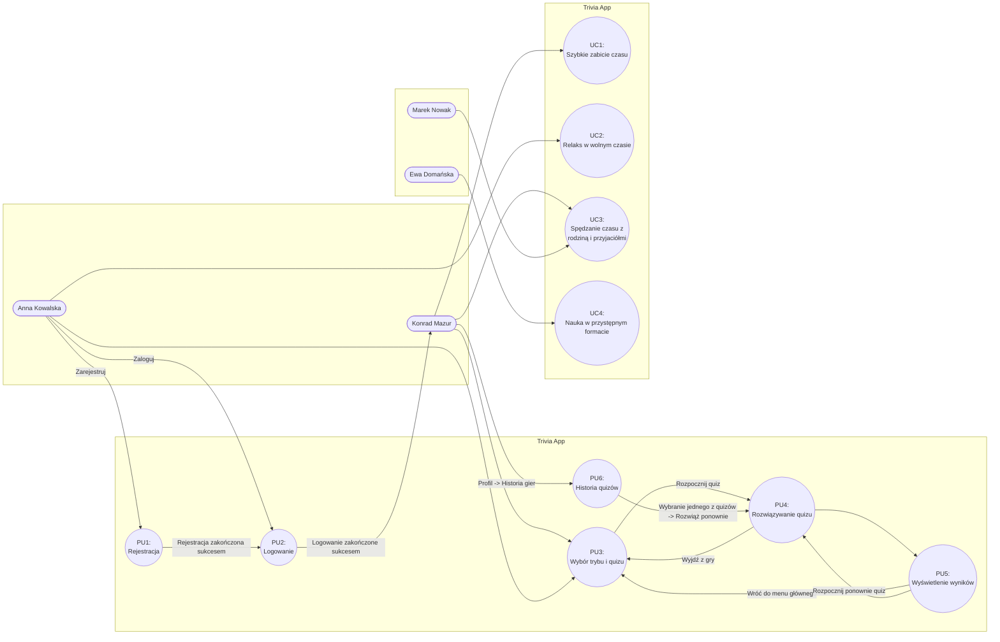

```mermaid
flowchart LR
    subgraph Actors[ ]
        A1([Użytkownik<br/>zalogowany])
        A2([Użytkownik<br/>niezalogowany])
    end
    subgraph Funkcjonalne przypadki użycia[Trivia App]
        direction TB
        PU1((PU1:<br/>Rejestracja))
        PU2((PU2:<br/>Logowanie))
        PU3((PU3:<br/>Wybór trybu i quizu))
        PU4((PU4:<br/>Rozwiązywanie quizu))
        PU5((PU5:<br/>Wyświetlenie wyników))
        PU6((PU6:<br/>Historia quizów))
    end
    A2 --> |Zaloguj| PU2
    A1 --> PU3
    A2 --> |Zarejestruj| PU1
    A2 --> PU3
    PU1 --> |Rejestracja zakończona sukcesem| PU2
    PU2 --> |Logowanie zakończone sukcesem| A1
    PU3 --> |Rozpocznij quiz| PU4
    PU4 --> PU5
    A1 --> |Profil -> Historia gier| PU6
    PU6 --> |Wybranie jednego z quizów -> Rozwiąż ponownie| PU4
    PU5 --> |Wróć do menu głównego| PU3
    PU5 --> |Rozpocznij ponownie quiz| PU4
    PU4 --> |Wyjdź z gry| PU3

    subgraph Actors2[ ]
        A1([Konrad Mazur])
        A2([Anna Kowalska])
        A3([Marek Nowak])
        A4([Ewa Domańska])
    end
    subgraph Przypadki użycia[Trivia App]
        direction TB
        UC1((UC1:<br/>Szybkie zabicie czasu))
        UC2((UC2:<br/>Relaks w wolnym czasie))
	UC3((UC3:<br/>Spędzanie czasu z <br/>rodziną i przyjaciółmi))
	UC4((UC4:<br/>Nauka w przystępnym formacie))
    end
    A1 --> UC1
    A1 --> UC3
    A2 --> UC2
    A3 --> UC3
    A4 --> UC4
```