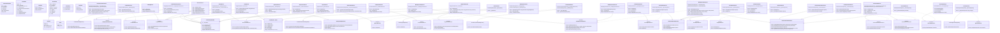

```mermaid
classDiagram

class Question {
  -String _id
  -String _text
  -Set<String> _correctAnswers
  -Set<String> _wrongAnswers
}

class PrivateGameOptions {
  -String _quizId
  -int _maxPlayers
  -int _password
  -int _timeLimit
  -string _quizCategory
  -string _mode
}

class ProfileData {
  -String _uid
  -String _username
  -int _totalQuestionsAnswered
  -int _correctAnswers
  -int _longestCorrectAnswersStreak
  -string _rank
  -int _ratingPoints
  -int _rankedGamesPlayed
  -int _rankedGamesWon
}

class UIOptions {
  -string _mainColor
  -string _secondaryColor
  -string _fontColor
}

class SessionData {
  -String _sessionId
  -int _maxPlayers
  -String _status
  -DateTime _startTime
  -DateTime _endTime
  -List<Player> _players
  -List<int> _placement
  -List<Question> _questions
  -int _code
}

class UserOptions {
  -int _soundVolume
  -int _musicVolume
}

class Player {
  -String _uid
  -String _name
}

class LoginData {
  -String _uid
  -String _email
  -String _password
}

SessionData o-- Player
SessionData o-- Question

%% =====================
%% UI – EKRANY
%% =====================

class LoadingScreen {
  -Future<void> _loadAssets()
  -void _navigateToNext()
  +Widget build(BuildContext context)
}

class MainMenuScreen {
  -void _navigate(int index)
  -void _onClickSingleplayerGame()
  -void _onClickMultiplayerGame()
  -void _onClickCreatePrivateGame()
  -void _onClickJoinPrivateGame()
  +Widget build(BuildContext context)
}

class ProfileScreen {
  -IProfileDataService _profileDataService
  -IAchievementService _achievementService

  -Future<void> _loadProfile()
  -void _onClickAchievements()
  +Widget build(BuildContext context)
}

class QuizListScreen {
  -IQuizListService _quizListService

  -Future<void> _loadQuizzes()
  -void _onClickQuiz(String quizId)
  +Widget build(BuildContext context)
}

class GameOptionsScreen {
  -IGameOptionsService _gameOptionsService

  -Future<void> _loadOptions()
  -Future<void> _onClickSave()
  -void _onClickClose()
  +Widget build(BuildContext context)
}

class UserOptionsScreen {
  -IUserOptionsService _userOptionsService

  -Future<void> _loadUserOptions()
  -Future<void> _onClickSave()
  -void _onClickClose()
  +Widget build(BuildContext context)
}

class PrivateLobbyScreen {
  -IPrivateGameCreationService _privateGameCreationService
  -IPrivateGameJoinService _privateGameJoinService

  -Future<void> _onClickCreate()
  -Future<void> _onClickJoin(int _code)
  -void _onClickLeave()
  +Widget build(BuildContext context)
}

class MultiplayerLobbyScreen {
  -IMultiplayerGameService _multiplayerGameService

  -Future<void> _onClickReady()
  -void _onClickLeave()
  +Widget build(BuildContext context)
}

class SingleplayerGameScreen {
  -ISingleplayerGameService _singleplayerGameService

  -Future<void> _onStartGame()
  -void _onAnswerSubimtted(string answer)
  -Future<void> _onEndGame()
  +Widget build(BuildContext context)
}

class MultiplayerGameScreen {
  -IMultiplayerGameService _multiplayerGameService

  -void _onAnswerSubimtted(string answer)
  -Future<void> _onEndGame()
  +Widget build(BuildContext context)
}

class LeaderboardScreen {
  -ILeaderboardService _leaderboardService

  -Future<void> _loadLeaderboard()
  -void _onClickClose()
  +Widget build(BuildContext context)
}

class ScoreTableScreen {
  -IScoreTableService _scoreTableService

  -void _onClickPlayAgain()
  -void _onClickMainMenu()
  -void _showTable()
  +Widget build(BuildContext context)
}

class LoginScreen {
  -ILoginAuthService _authService

  -Future<void> _onClickLogin(string email, string password)
  -void _onClickOpenRegister()
  -void _showMessage()
  +Widget build(BuildContext context)
}

class RegistrationScreen {
  -IRegisterAuthService _authService

  -void _onClickClose()
  -Future<void> _onClickRegister(string email, string password, string username)
  -void _showMessage()
  +Widget build(BuildContext context)
}

class AchievementScreen {
  -IAchievementService _achievementService

  -void _onClickClose()
  -Future<void> _getAchievements(ProfileData profile)
  +Widget build(BuildContext context)
}

%% =====================
%% WIDGETY
%% =====================

class BottomNavigationBar {
  -int _currentIndex

  -void _navigate(int index)
  -void _onClickProfile()
  -void _onClickCategories()
  -void _onClickMainMenu()
  +Widget build(BuildContext context)
}

class LoginRegister_popup {
  -void _onClickLogin()
  -void _onClickRegister()
  -void _onClickClose()
  -void _showPopUp()
  -void _closePopUp()
  +Widget build(BuildContext context)
}

%% =====================
%% INTERFEJSY SERWISÓW
%% =====================

class ILoginAuthService {
  <<interface>>
  +Future<void> signInWithEmail(String email, String password)
  +Future<void> signOut()
  +Stream authStateChanges()
}

class IRegisterAuthService {
  <<interface>>
  +Future<void> register(String email, String password, String displayName)
  +Future<ProfileData> generateProfile()
  +Stream authStateChanges()
}

class IQuestionService {
  <<interface>>
  +Future<List<Question>> getQuestions(int limit, string category)
}

class ISingleplayerGameService {
  <<interface>>
  +Future<SessionData> startGame(GameOptions options)
  +Future<void> registerAnswer(Question question, String answer)
  +bool checkAnswer(Question question, String answer)
  +Future<void> endGame(SessionData session)
}

class IMultiplayerGameService {
  <<interface>>
  +Future<void> startMultiplayerGame()
  +Future<void> registerAnswer(Player player, Question question, String answer)
  +bool checkAnswer(Question question, String answer)
  +Future<void> endGame(SessionData session)
  +Stream<SessionData> listenToSession(String sessionId)
}

class IPrivateGameCreationService {
  <<interface>>
  +Future<SessionData> createPrivateGame(GameOptions options)
  +Future<void> deleteGame(String sessionId)
}

class IPrivateGameJoinService {
  <<interface>>
  +Future<SessionData> joinPrivateGame(int code)
  +Future<void> leaveGame(String sessionId, String playerId)
  +Stream<SessionData> listenToLobby(String sessionId)
}

class IGameOptionsService {
  <<interface>>
  +Future<void> saveOptions(UserOptions options)
  +Future<UserOptions> getOptions()
}

class IUserOptionsService {
  <<interface>>
  +Future<void> saveOptions(UserOptions options)
  +Future<UserOptions> getOptions()
}

class IUIOptionsService {
  <<interface>>
  +Future<UIOptions> loadUIOptions()
  +Future<void> saveUIOptions(UIOptions options)
}

class ILeaderboardService {
  <<interface>>
  +Future<List<ProfileData>> getLeaderboard()
  +Future<int> getUserRank(String userId)
}

class IAchievementService {
  <<interface>>
  +Future<List<Achievement>> getAchievements(ProfileData profile)
  +Future<void> updateAchievements(ProfileData profile, SessionData result)
}

class IQuizListService {
  <<interface>>
  +Future<List<Quiz>> getQuizList()
}

class IProfileDataService {
  <<interface>>
  +Future<ProfileData> getProfileData(String uid)
  +Future<void> updateProfileData(ProfileData data)
}

class IScoreTableService {
  <<interface>>
  +Future<SessionData> getGameData(String sessionid)
}

%% =====================
%% SERWISY
%% =====================

class AuthLoginService {
  -FirebaseAuthRepository _authRepository

  -Future<void> _signInWithEmail(String email, String password)
  -Future<void> _signOut()
  -Stream _authStateChanges()
}

class AuthRegisterService {
  -FirebaseAuthRepository _authRepository
  -FirebaseProfileRepository _profileRepository

  -Future<void> _register(String email, String password, String displayName)
  -Future<ProfileData> _generateProfile()
  -Stream _authStateChanges()
}

class QuestionService {
  -FirebaseQuestionRepository _questionRepository

  -Future<List<Question>> _getQuestions(int limit, string category)
}

class SingleplayerGameService {
  -FirebaseSessionRepository _sessionRepository
  -FirebaseQuestionRepository _questionRepository

  -Future<SessionData> _startGame(GameOptions options)
  -Future<void> _registerAnswer(Question question, String answer)
  -bool _checkAnswer(Question question, String answer)
  -Future<void> _endGame(SessionData session)
}

class MultiplayerGameService {
  -FirebaseSessionRepository _sessionRepository
  -FirebaseQuestionRepository _questionRepository
  ---
  -Future<void> _startMultiplayerGame()
  -Future<void> _registerAnswer(Player player, Question question, String answer)
  -bool _checkAnswer(Question question, String answer)
  -Future<void> _endGame(SessionData session)
  -Stream<SessionData> _listenToSession(String sessionId)
}

class PrivateGameCreationService {
  -FirebaseSessionRepository _sessionRepository

  -Future<SessionData> _createPrivateGame(GameOptions options)
  -Future<void> _deleteGame(String sessionId)
}

class PrivateGameJoinService {
  -FirebaseSessionRepository _sessionRepository

  -Future<SessionData> _joinPrivateGame(int code)
  -Future<void> _leaveGame(String sessionId, String playerId)
  -Stream<SessionData> _listenToLobby(String sessionId)
}

class GameOptionsService {
  -FirebaseOptionsRepository _optionsRepository

  -Future<void> _saveOptions(UserOptions options)
  -Future<UserOptions> _getOptions()
}

class UserOptionsService {
  -FirebaseOptionsRepository _optionsRepository

  -Future<void> _saveOptions(UserOptions options)
  -Future<UserOptions> _getOptions()
}

class UIOptionsService {
  -FirebaseOptionsRepository _optionsRepository

  -Future<UIOptions> _loadUIOptions()
  -Future<void> _saveUIOptions(UIOptions options)
}

class LeaderboardService {
  -FirebaseLeaderboardRepository _leaderboardRepository
  -FirebaseProfileRepository _profileRepository

  -Future<List<ProfileData>> _getLeaderboard()
  -Future<int> _getUserRank(String userId)
}

class AchievementService {
  -FirebaseAchievementRepository _achievementRepository

  -Future<List<Achievement>> _getAchievements(ProfileData profile)
  -Future<void> _updateAchievements(ProfileData profile, SessionData result)
}

class QuizListService {
  -FirebaseQuizRepository _quizRepository

  -Future<List<Quiz>> _getQuizList()
}

class ProfileDataService {
  -FirebaseProfileRepository _profileRepository

  -Future<ProfileData> _getProfileData(String uid)
  -Future<void> _updateProfileData(ProfileData data)
}

class ScoreTableService {
  -FirebaseSessionRepository _sessionRepository
  
  -Future<SessionData> _getGameData(String sessionid)
}

%% =====================
%% FIREBASE / INFRASTRUKTURA
%% =====================

class FirebaseAuthRepository {
  +Future<ProfileData> registerWithEmail(String email, String password, String displayName)
  +Future<ProfileData> signInWithEmail(String email, String password)
  +Future<void> signOut()
  +Stream authStateChanges()
}

class FirebaseQuestionRepository {
  +Future<List<Question>> getRandomQuestions(int limit)
}

class FirebaseQuizRepository {
  +Future<List<Quiz>> getQuizList()
}

class FirebaseProfileRepository {
  +Future<ProfileData> getProfileData(String uid)
  +Future<void> updateProfileData(ProfileData profileData)
}

class FirebaseLeaderboardRepository {
  +Future<List<ProfileData>> getLeaderboard(String quizId)
}

class FirebaseAchievementRepository {
  +Future<List<Achievement>> getAchievements(ProfileData profileData)
  +Future<void> updateAchievements(ProfileData profileData, SessionData gameResult)
}

class FirebaseSessionRepository {
  +Future<SessionData> createMultiplayerSession(String categoryId, String playerName)
  +Future<SessionData> joinMultiplayerSession(String sessionId, String playerName)
  +Stream getSessionStream(String sessionId)
  +Future<void> updatePlayerScore(String sessionId, String playerName, int score)
  +Future<void> updateSessionStatus(String sessionId, String status)
}

class FirebaseOptionsRepository {
  +Future<void> saveOptions(UserOptions options)
  +Future<UserOptions> getOptions()
  +Future<void> saveUIOptions(UIOptions options)
  +Future<UIOptions> loadUIOptions()
}

%% =====================
%% RELACJE – UI → INTERFEJSY
%% =====================

LoadingScreen --> ILoginAuthService
MainMenuScreen --> ILoginAuthService
ProfileScreen --> IProfileDataService
ProfileScreen --> IAchievementService
QuizListScreen --> IQuizListService
GameOptionsScreen --> IGameOptionsService
UserOptionsScreen --> IUserOptionsService
PrivateLobbyScreen --> IPrivateGameCreationService
PrivateLobbyScreen --> IPrivateGameJoinService
MultiplayerLobbyScreen --> IMultiplayerGameService
SingleplayerGameScreen --> ISingleplayerGameService
MultiplayerGameScreen --> IMultiplayerGameService
LeaderboardScreen --> ILeaderboardService
ScoreTableScreen --> IScoreTableService
LoginScreen --> ILoginAuthService
RegistrationScreen --> IRegisterAuthService
AchievementScreen --> IAchievementService

MainMenuScreen --> BottomNavigationBar
ProfileScreen --> BottomNavigationBar
QuizListScreen --> BottomNavigationBar
SingleplayerGameScreen --> BottomNavigationBar
MultiplayerLobbyScreen --> BottomNavigationBar
LeaderboardScreen --> BottomNavigationBar

LoginScreen --> LoginRegister_popup
RegistrationScreen --> LoginRegister_popup

%% SERWISY → INTERFEJSY

AuthLoginService ..|> ILoginAuthService
AuthRegisterService ..|> IRegisterAuthService
QuestionService ..|> IQuestionService
SingleplayerGameService ..|> ISingleplayerGameService
MultiplayerGameService ..|> IMultiplayerGameService
PrivateGameCreationService ..|> IPrivateGameCreationService
PrivateGameJoinService ..|> IPrivateGameJoinService
GameOptionsService ..|> IGameOptionsService
UserOptionsService ..|> IUserOptionsService
UIOptionsService ..|> IUIOptionsService
LeaderboardService ..|> ILeaderboardService
AchievementService ..|> IAchievementService
QuizListService ..|> IQuizListService
ProfileDataService ..|> IProfileDataService
ScoreTableService ..|> IScoreTableService

%% SERWISY → REPOZYTORIA

AuthLoginService --> FirebaseAuthRepository
AuthRegisterService --> FirebaseAuthRepository
QuestionService --> FirebaseQuestionRepository
QuizListService --> FirebaseQuizRepository
ProfileDataService --> FirebaseProfileRepository
LeaderboardService --> FirebaseLeaderboardRepository
AchievementService --> FirebaseAchievementRepository
MultiplayerGameService --> FirebaseSessionRepository
PrivateGameCreationService --> FirebaseSessionRepository
PrivateGameJoinService --> FirebaseSessionRepository
GameOptionsService --> FirebaseOptionsRepository
UserOptionsService --> FirebaseOptionsRepository
UIOptionsService --> FirebaseOptionsRepository
ScoreTableService --> FirebaseSessionRepository
```