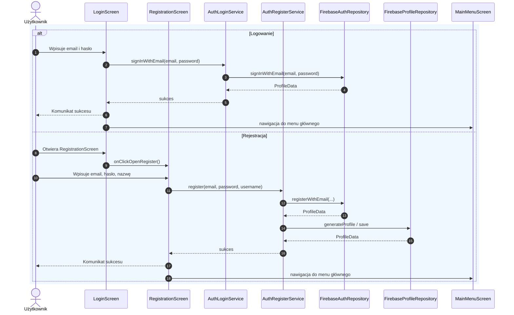

```mermaid
sequenceDiagram
    autonumber
    actor U as Użytkownik
    participant LS as LoginScreen
    participant RS as RegistrationScreen
    participant LA as AuthLoginService
    participant RA as AuthRegisterService
    participant FA as FirebaseAuthRepository
    participant FP as FirebaseProfileRepository
    participant MN as MainMenuScreen

    rect rgb(240,248,255)
    alt Logowanie
        U->>LS: Wpisuje email i hasło
        LS->>LA: signInWithEmail(email, password)
        LA->>FA: signInWithEmail(email, password)
        FA-->>LA: ProfileData
        LA-->>LS: sukces
        LS-->>U: Komunikat sukcesu
        LS->>MN: nawigacja do menu głównego
    else Rejestracja
        U->>LS: Otwiera RegistrationScreen
        LS->>RS: onClickOpenRegister()
        U->>RS: Wpisuje email, hasło, nazwę
        RS->>RA: register(email, password, username)
        RA->>FA: registerWithEmail(...)
        FA-->>RA: ProfileData
        RA->>FP: generateProfile / save
        FP-->>RA: ProfileData
        RA-->>RS: sukces
        RS-->>U: Komunikat sukcesu
        RS->>MN: nawigacja do menu głównego
    end
    end
```