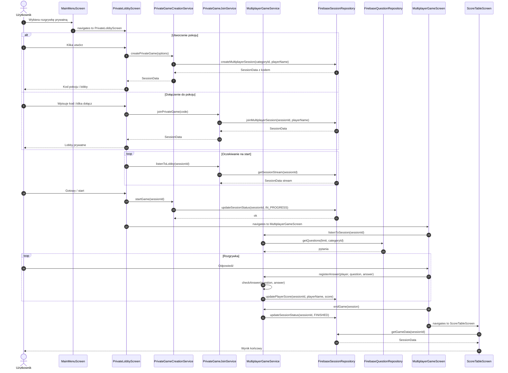

```mermaid
sequenceDiagram
    autonumber
    actor U as Użytkownik
    participant MM as MainMenuScreen
    participant PL as PrivateLobbyScreen
    participant PGC as PrivateGameCreationService
    participant PGJ as PrivateGameJoinService
    participant MGS as MultiplayerGameService
    participant FSR as FirebaseSessionRepository
    participant FQR as FirebaseQuestionRepository
    participant PGS as MultiplayerGameScreen
    participant ST as ScoreTableScreen

    U->>MM: Wybiera rozgrywkę prywatną
    MM->>PL: navigates to PrivateLobbyScreen
    alt Utworzenie pokoju
        U->>PL: Klika utwórz
        PL->>PGC: createPrivateGame(options)
        PGC->>FSR: createMultiplayerSession(categoryId, playerName)
        FSR-->>PGC: SessionData z kodem
        PGC-->>PL: SessionData
        PL-->>U: Kod pokoju i lobby
    else Dołączenie do pokoju
        U->>PL: Wpisuje kod i klika dołącz
        PL->>PGJ: joinPrivateGame(code)
        PGJ->>FSR: joinMultiplayerSession(sessionId, playerName)
        FSR-->>PGJ: SessionData
        PGJ-->>PL: SessionData
        PL-->>U: Lobby prywatne
    end
    loop Oczekiwanie na start
        PL->>PGJ: listenToLobby(sessionId)
        PGJ->>FSR: getSessionStream(sessionId)
        FSR-->>PGJ: SessionData stream
    end
    U->>PL: Gotowy / start
    PL->>PGC: startGame(sessionId)
    PGC->>FSR: updateSessionStatus(sessionId, IN_PROGRESS)
    FSR-->>PGC: ok
    PL->>PGS: navigates to MultiplayerGameScreen
    PGS->>MGS: listenToSession(sessionId)
    MGS->>FQR: getQuestions(limit, categoryId)
    FQR-->>MGS: pytania
    loop Rozgrywka
        U->>PGS: Odpowiedź
        PGS->>MGS: registerAnswer(player, question, answer)
        MGS->>MGS: checkAnswer(question, answer)
        MGS->>FSR: updatePlayerScore(sessionId, playerName, score)
    end
    PGS->>MGS: endGame(session)
    MGS->>FSR: updateSessionStatus(sessionId, FINISHED)
    PGS->>ST: navigates to ScoreTableScreen
    ST->>FSR: getGameData(sessionId)
    FSR-->>ST: SessionData
    ST-->>U: Wynik końcowy
```