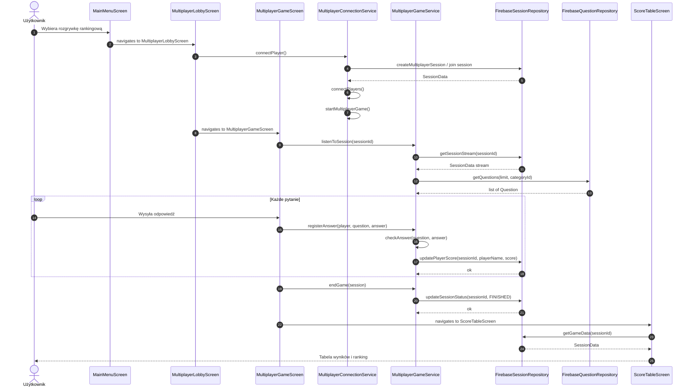

```mermaid
sequenceDiagram
    autonumber
    actor U as Użytkownik
    participant MM as MainMenuScreen
    participant ML as MultiplayerLobbyScreen
    participant MS as MultiplayerGameScreen
    participant MCS as MultiplayerConnectionService
    participant MGS as MultiplayerGameService
    participant FSR as FirebaseSessionRepository
    participant FQR as FirebaseQuestionRepository
    participant ST as ScoreTableScreen

    U->>MM: Wybiera rozgrywkę rankingową
    MM->>ML: navigates to MultiplayerLobbyScreen
    ML->>MCS: connectPlayer()
    MCS->>FSR: createMultiplayerSession / join session
    FSR-->>MCS: SessionData
    MCS->>MCS: connectPlayers()
    MCS->>MCS: startMultiplayerGame()
    ML->>MS: navigates to MultiplayerGameScreen
    MS->>MGS: listenToSession(sessionId)
    MGS->>FSR: getSessionStream(sessionId)
    FSR-->>MGS: SessionData stream
    MGS->>FQR: getQuestions(limit, categoryId)
    FQR-->>MGS: list of Question
    loop Każde pytanie
        U->>MS: Wysyła odpowiedź
        MS->>MGS: registerAnswer(player, question, answer)
        MGS->>MGS: checkAnswer(question, answer)
        MGS->>FSR: updatePlayerScore(sessionId, playerName, score)
        FSR-->>MGS: ok
    end
    MS->>MGS: endGame(session)
    MGS->>FSR: updateSessionStatus(sessionId, FINISHED)
    FSR-->>MGS: ok
    MS->>ST: navigates to ScoreTableScreen
    ST->>FSR: getGameData(sessionId)
    FSR-->>ST: SessionData
    ST-->>U: Tabela wyników i ranking
```