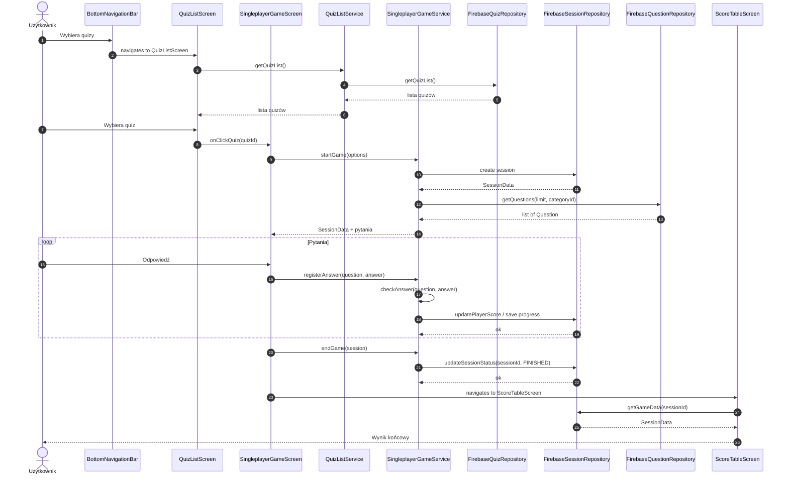

```mermaid
sequenceDiagram
    autonumber
    actor U as Użytkownik
    participant BN as BottomNavigationBar
    participant QL as QuizListScreen
    participant SP as SingleplayerGameScreen
    participant QS as QuizListService
    participant SG as SingleplayerGameService
    participant QR as FirebaseQuizRepository
    participant FSR as FirebaseSessionRepository
    participant FQR as FirebaseQuestionRepository
    participant ST as ScoreTableScreen

    U->>BN: Wybiera quizy
    BN->>QL: navigates to QuizListScreen
    QL->>QS: getQuizList()
    QS->>QR: getQuizList()
    QR-->>QS: lista quizów
    QS-->>QL: lista quizów
    U->>QL: Wybiera quiz
    QL->>SP: onClickQuiz(quizId)
    SP->>SG: startGame(options)
    SG->>FSR: create session
    FSR-->>SG: SessionData
    SG->>FQR: getQuestions(limit, categoryId)
    FQR-->>SG: list of Question
    SG-->>SP: SessionData + pytania
    loop Pytania
        U->>SP: Odpowiedź
        SP->>SG: registerAnswer(question, answer)
        SG->>SG: checkAnswer(question, answer)
        SG->>FSR: updatePlayerScore / save progress
        FSR-->>SG: ok
    end
    SP->>SG: endGame(session)
    SG->>FSR: updateSessionStatus(sessionId, FINISHED)
    FSR-->>SG: ok
    SP->>ST: navigates to ScoreTableScreen
    ST->>FSR: getGameData(sessionId)
    FSR-->>ST: SessionData
    ST-->>U: Wynik końcowy
```
