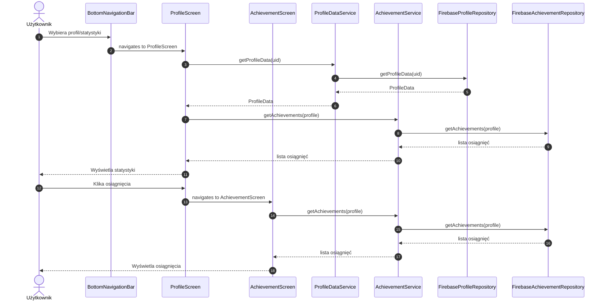

```mermaid
sequenceDiagram
    autonumber
    actor U as Użytkownik
    participant BN as BottomNavigationBar
    participant PS as ProfileScreen
    participant AS as AchievementScreen
    participant PDS as ProfileDataService
    participant ACH as AchievementService
    participant FPR as FirebaseProfileRepository
    participant FAR as FirebaseAchievementRepository

    U->>BN: Wybiera profil/statystyki
    BN->>PS: navigates to ProfileScreen
    PS->>PDS: getProfileData(uid)
    PDS->>FPR: getProfileData(uid)
    FPR-->>PDS: ProfileData
    PDS-->>PS: ProfileData
    PS->>ACH: getAchievements(profile)
    ACH->>FAR: getAchievements(profile)
    FAR-->>ACH: lista osiągnięć
    ACH-->>PS: lista osiągnięć
    PS-->>U: Wyświetla statystyki
    U->>PS: Klika osiągnięcia
    PS->>AS: navigates to AchievementScreen
    AS->>ACH: getAchievements(profile)
    ACH->>FAR: getAchievements(profile)
    FAR-->>ACH: lista osiągnięć
    ACH-->>AS: lista osiągnięć
    AS-->>U: Wyświetla osiągnięcia
```