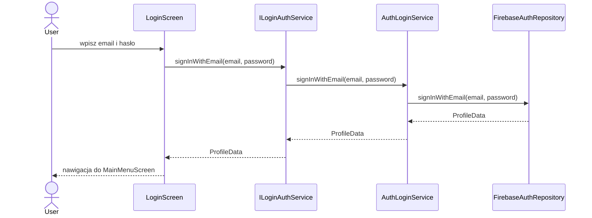
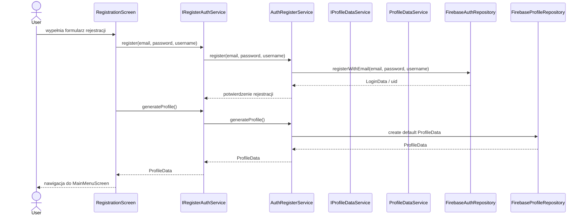
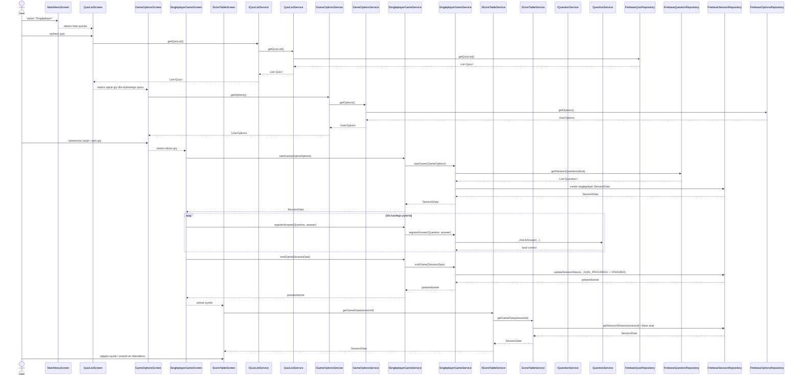
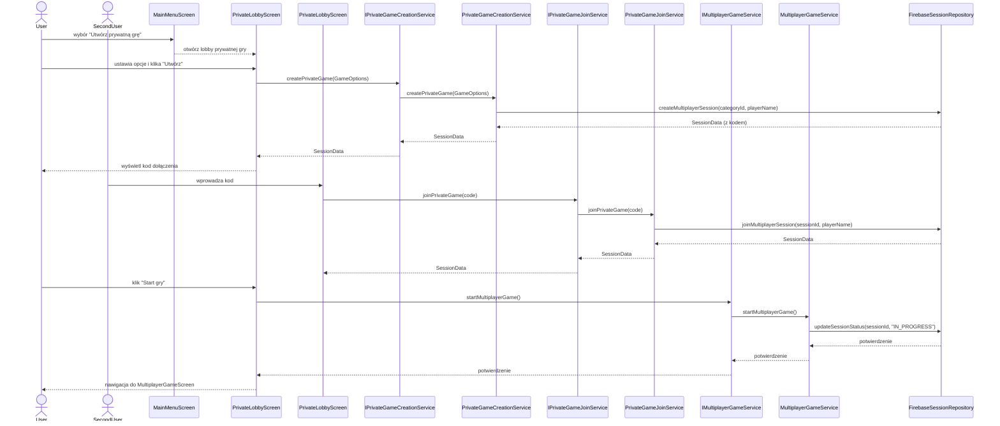
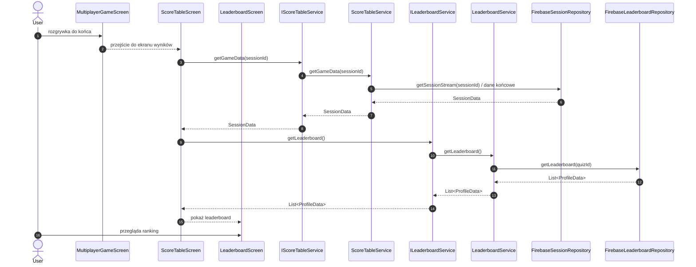

```mermaid
sequenceDiagram
    actor User
    participant LoginScreen
    participant AuthPort as ILoginAuthService
    participant AuthService as AuthLoginService
    participant AuthRepo as FirebaseAuthRepository

    User->>LoginScreen: wpisz email i hasło
    LoginScreen->>AuthPort: signInWithEmail(email, password)
    AuthPort->>AuthService: signInWithEmail(email, password)
    AuthService->>AuthRepo: signInWithEmail(email, password)
    AuthRepo-->>AuthService: ProfileData
    AuthService-->>AuthPort: ProfileData
    AuthPort-->>LoginScreen: ProfileData
    LoginScreen-->>User: nawigacja do MainMenuScreen
```

```mermaid
sequenceDiagram
    actor User
    participant RegistrationScreen
    participant RegPort as IRegisterAuthService
    participant RegService as AuthRegisterService
    participant ProfilePort as IProfileDataService
    participant ProfileService as ProfileDataService
    participant AuthRepo as FirebaseAuthRepository
    participant ProfileRepo as FirebaseProfileRepository

    User->>RegistrationScreen: wypełnia formularz rejestracji
    RegistrationScreen->>RegPort: register(email, password, username)
    RegPort->>RegService: register(email, password, username)
    RegService->>AuthRepo: registerWithEmail(email, password, username)
    AuthRepo-->>RegService: LoginData / uid
    RegService-->>RegPort: potwierdzenie rejestracji

    RegistrationScreen->>RegPort: generateProfile()
    RegPort->>RegService: generateProfile()
    RegService->>ProfileRepo: create default ProfileData
    ProfileRepo-->>RegService: ProfileData
    RegService-->>RegPort: ProfileData
    RegPort-->>RegistrationScreen: ProfileData

    RegistrationScreen-->>User: nawigacja do MainMenuScreen
```

```mermaid
sequenceDiagram
    actor User
    participant MainMenu as MainMenuScreen
    participant QuizList as QuizListScreen
    participant GameOpts as GameOptionsScreen
    participant SingleGame as SingleplayerGameScreen
    participant ScoreScreen as ScoreTableScreen

    participant QuizPort as IQuizListService
    participant QuizService as QuizListService
    participant GameOptsPort as IGameOptionsService
    participant GameOptsService as GameOptionsService
    participant SinglePort as ISingleplayerGameService
    participant SingleService as SingleplayerGameService
    participant ScorePort as IScoreTableService
    participant ScoreService as ScoreTableService

    participant QuestionPort as IQuestionService
    participant QuestionServiceImpl as QuestionService
    participant QuizRepo as FirebaseQuizRepository
    participant QuestionRepo as FirebaseQuestionRepository
    participant SessionRepo as FirebaseSessionRepository
    participant OptionsRepo as FirebaseOptionsRepository

    User->>MainMenu: wybór "Singleplayer"
    MainMenu-->>QuizList: otwórz listę quizów

    User->>QuizList: wybierz quiz
    QuizList->>QuizPort: getQuizList()
    QuizPort->>QuizService: getQuizList()
    QuizService->>QuizRepo: getQuizList()
    QuizRepo-->>QuizService: List<Quiz>
    QuizService-->>QuizPort: List<Quiz>
    QuizPort-->>QuizList: List<Quiz>
    QuizList-->>GameOpts: otwórz opcje gry dla wybranego quizu

    GameOpts->>GameOptsPort: getOptions()
    GameOptsPort->>GameOptsService: getOptions()
    GameOptsService->>OptionsRepo: getOptions()
    OptionsRepo-->>GameOptsService: UserOptions
    GameOptsService-->>GameOptsPort: UserOptions
    GameOptsPort-->>GameOpts: UserOptions

    User->>GameOpts: zatwierdza opcje i start gry
    GameOpts-->>SingleGame: otwórz ekran gry

    SingleGame->>SinglePort: startGame(GameOptions)
    SinglePort->>SingleService: startGame(GameOptions)
    SingleService->>QuestionRepo: getRandomQuestions(limit)
    QuestionRepo-->>SingleService: List<Question>
    SingleService->>SessionRepo: create singleplayer SessionData
    SessionRepo-->>SingleService: SessionData
    SingleService-->>SinglePort: SessionData
    SinglePort-->>SingleGame: SessionData

    loop dla każdego pytania
        SingleGame->>SinglePort: registerAnswer(Question, answer)
        SinglePort->>SingleService: registerAnswer(Question, answer)
        SingleService->>QuestionServiceImpl: _checkAnswer(...)
        QuestionServiceImpl-->>SingleService: bool correct
    end

    SingleGame->>SinglePort: endGame(SessionData)
    SinglePort->>SingleService: endGame(SessionData)
    SingleService->>SessionRepo: updateSessionStatus(...)\n(IN_PROGRESS -> FINISHED)
    SessionRepo-->>SingleService: potwierdzenie
    SingleService-->>SinglePort: potwierdzenie
    SinglePort-->>SingleGame: potwierdzenie

    SingleGame-->>ScoreScreen: pokaż wyniki
    ScoreScreen->>ScorePort: getGameData(sessionId)
    ScorePort->>ScoreService: getGameData(sessionId)
    ScoreService->>SessionRepo: getSessionStream(sessionId) / dane sesji
    SessionRepo-->>ScoreService: SessionData
    ScoreService-->>ScorePort: SessionData
    ScorePort-->>ScoreScreen: SessionData

    User->>ScoreScreen: ogląda wyniki / powrót do MainMenu
```

```mermaid
sequenceDiagram
    actor User
    actor SecondUser
    participant MainMenu as MainMenuScreen
    participant PrivateLobby as PrivateLobbyScreen
    participant PrivateLobby2 as PrivateLobbyScreen
    participant PrivateCreatePort as IPrivateGameCreationService
    participant PrivateCreateService as PrivateGameCreationService
    participant PrivateJoinPort as IPrivateGameJoinService
    participant PrivateJoinService as PrivateGameJoinService
    participant MultiPort as IMultiplayerGameService
    participant MultiService as MultiplayerGameService
    participant SessionRepo as FirebaseSessionRepository

    User->>MainMenu: wybór "Utwórz prywatną grę"
    MainMenu-->>PrivateLobby: otwórz lobby prywatnej gry

    User->>PrivateLobby: ustawia opcje i klika "Utwórz"
    PrivateLobby->>PrivateCreatePort: createPrivateGame(GameOptions)
    PrivateCreatePort->>PrivateCreateService: createPrivateGame(GameOptions)
    PrivateCreateService->>SessionRepo: createMultiplayerSession(categoryId, playerName)
    SessionRepo-->>PrivateCreateService: SessionData (z kodem)
    PrivateCreateService-->>PrivateCreatePort: SessionData
    PrivateCreatePort-->>PrivateLobby: SessionData
    PrivateLobby-->>User: wyświetl kod dołączenia

    %% Drugi gracz dołącza po kodzie
    SecondUser->>PrivateLobby2: wprowadza kod
    PrivateLobby2->>PrivateJoinPort: joinPrivateGame(code)
    PrivateJoinPort->>PrivateJoinService: joinPrivateGame(code)
    PrivateJoinService->>SessionRepo: joinMultiplayerSession(sessionId, playerName)
    SessionRepo-->>PrivateJoinService: SessionData
    PrivateJoinService-->>PrivateJoinPort: SessionData
    PrivateJoinPort-->>PrivateLobby2: SessionData

    %% Start gry
    User->>PrivateLobby: klik "Start gry"
    PrivateLobby->>MultiPort: startMultiplayerGame()
    MultiPort->>MultiService: startMultiplayerGame()
    MultiService->>SessionRepo: updateSessionStatus(sessionId, "IN_PROGRESS")
    SessionRepo-->>MultiService: potwierdzenie
    MultiService-->>MultiPort: potwierdzenie
    MultiPort-->>PrivateLobby: potwierdzenie
    PrivateLobby-->>User: nawigacja do MultiplayerGameScreen
```

```mermaid
sequenceDiagram
    autonumber
    actor User
    participant MultiGame as MultiplayerGameScreen
    participant ScoreScreen as ScoreTableScreen
    participant LeaderboardUI as LeaderboardScreen
    participant ScorePort as IScoreTableService
    participant ScoreService as ScoreTableService
    participant LeaderboardPort as ILeaderboardService
    participant LeaderboardServiceImpl as LeaderboardService
    participant SessionRepo as FirebaseSessionRepository
    participant LeaderboardRepo as FirebaseLeaderboardRepository

    User->>MultiGame: rozgrywka do końca
    MultiGame-->>ScoreScreen: przejście do ekranu wyników

    ScoreScreen->>ScorePort: getGameData(sessionId)
    ScorePort->>ScoreService: getGameData(sessionId)
    ScoreService->>SessionRepo: getSessionStream(sessionId) / dane końcowe
    SessionRepo-->>ScoreService: SessionData
    ScoreService-->>ScorePort: SessionData
    ScorePort-->>ScoreScreen: SessionData

    ScoreScreen->>LeaderboardPort: getLeaderboard()
    LeaderboardPort->>LeaderboardServiceImpl: getLeaderboard()
    LeaderboardServiceImpl->>LeaderboardRepo: getLeaderboard(quizId)
    LeaderboardRepo-->>LeaderboardServiceImpl: List<ProfileData>
    LeaderboardServiceImpl-->>LeaderboardPort: List<ProfileData>
    LeaderboardPort-->>ScoreScreen: List<ProfileData>

    ScoreScreen-->>LeaderboardUI: pokaż leaderboard
    User->>LeaderboardUI: przegląda ranking
```